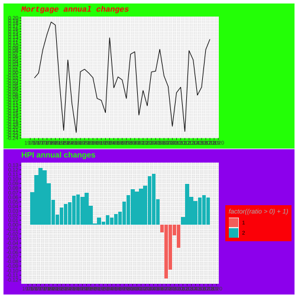
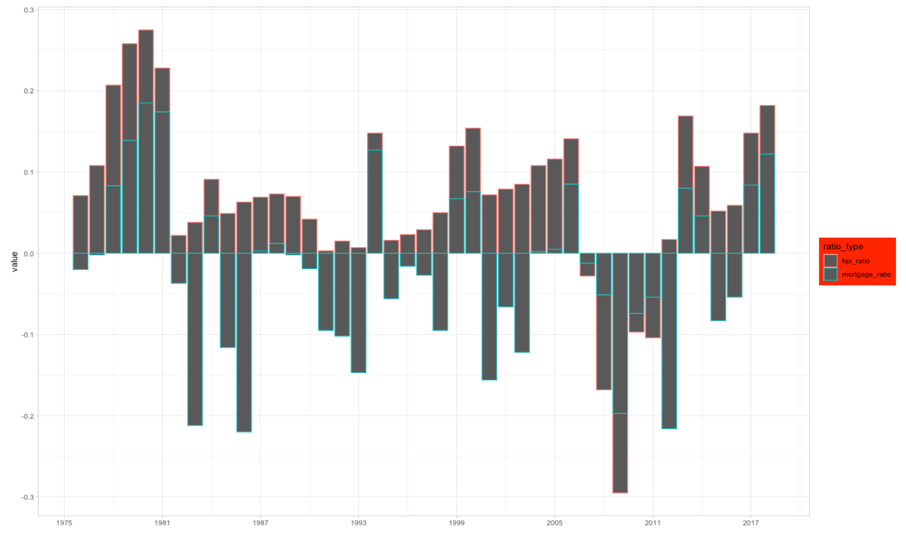

```{r setup, include=FALSE}
options(htmltools.dir.version = FALSE, 
        echo = FALSE, 
        warning = FALSE, 
        message = FALSE,  
        include=FALSE)
library(tidyverse)
library(lubridate)
library(here)
library(patchwork)
library(kableExtra)
library(ggthemes)
library(knitr)
library(xaringanthemer)
```

```{r xaringan-themer, include=FALSE, warning=FALSE}
style_solarized_light()
```


background-image: url(tiny_house.jpg)
background-position: right bottom

# Group member

### ycui0008
### hngo0005
### yhee0063

```{css, echo = FALSE}
.remark-code {
  font-size:24px;
}
.tiny .remark-code {
  font-size: 50%;
}

.ty .remark-code {
  font-size: 60%;
}

.left-code {
  width: 45%;
  height: 92%;
  float: left;
}
.right-plot {
  width: 53%;
  float: right;
  padding-left: 2%;
}
```

---
class: center, middle

# Background story


#### The housing market represents about 15% to 18% of U.S. GDP(NAHB 2019), indicating a strong influence over the US economy


#### US families mostly take out mortgage loans to finance their housing purchase. Is there existed a relation between the HPI and the mortgage rates?

---
class: center, middle

# Data set
For this presentation, we used two dataset

---

```{r read-data, include =FALSE}
state_hpi <-readr::read_csv(here::here("data/state_hpi.csv")) 
mortgage_rates <- readr::read_csv(here::here("data/mortgage_rates.csv")) 
```

```{r wrangle-2, include = FALSE, message=FALSE, warning=FALSE}
mortgage_rates_month <-  mortgage_rates %>%
  mutate(year = year(date), month = month(date)) %>%
  dplyr::select("date","year","month","fixed_rate_30_yr") %>%
  group_by(year,month) %>%
  summarise("fixed_rate_30_yr" = mean(fixed_rate_30_yr))

state_hpi <- state_hpi %>% 
  mutate(date = ymd(year*10000+month*100+1)) 

nation_hpi <- state_hpi %>%
  dplyr::select("date","year","month","us_avg") %>%
  distinct()

```

```{r hpi-clean, include = FALSE, message=FALSE, warning=FALSE}
nation_hpi_change <- nation_hpi %>% 
  group_by(year) %>% 
  summarise(us_avg = mean(us_avg)) %>% 
  mutate(ratio = (us_avg - lag(us_avg)) / us_avg,
         ratio = round(ratio,3))
  
```

```{r clean-mortgage, include = FALSE, message=FALSE, warning=FALSE}
mortgage_fix30 <- mortgage_rates %>% 
  select(1:2) %>% 
  mutate(year = year(date)) %>% 
  filter(year >= 1975) %>% 
  group_by(year) %>% 
  summarise(fixed_30yr_avg = mean(fixed_rate_30_yr)) %>% 
  mutate(ratio = (fixed_30yr_avg - lag(fixed_30yr_avg)) / fixed_30yr_avg,
         ratio = round(ratio,3))

```

### The annual HPI change
```{r state_hpi, echo = FALSE}
knitr::kable(head(nation_hpi_change, 5), format = 'html') %>% 
  kable_material(c("striped", "hover")) %>% 
  kable_styling(full_width = F)
```

* `us_avg`: Calculated annual House Price Index - averaged at national level

* `ratio`: change versus previous year

---


### The annual mortgage rates change
```{r mortgage_rates, echo = FALSE}
knitr::kable(head(mortgage_fix30), format = 'html') %>% 
  kable_material(c("striped", "hover")) %>% 
  kable_styling(full_width = F)
```

* `fixed_rate_30_yr`: Fixed rate 30 year mortgage (percent).

* `ratio`: change versus previous year


---

# This is original plot

.pull-left[
```{r wrangle, echo = FALSE, message=FALSE, warning=FALSE}
mortgage_rates_month <-  mortgage_rates %>%
  mutate(year = year(date), month = month(date)) %>%
  dplyr::select("date","year","month","fixed_rate_30_yr") %>%
  group_by(year,month) %>%
  summarise("fixed_rate_30_yr" = mean(fixed_rate_30_yr))

state_hpi <- state_hpi %>% 
  mutate(date = ymd(year*10000+month*100+1)) 

nation_hpi <- state_hpi %>%
  dplyr::select("date","year","month","us_avg") %>%
  distinct()

```


```{r mort-fixed30, echo = FALSE, message=FALSE, warning=FALSE}
mortgage_fix30 <- mortgage_rates %>% 
  select(1:2) %>% 
  mutate(year = year(date)) %>% 
  filter(year >= 1975) %>% 
  group_by(year) %>% 
  summarise(fixed_30yr_avg = mean(fixed_rate_30_yr)) %>% 
  mutate(ratio = (fixed_30yr_avg - lag(fixed_30yr_avg)) / fixed_30yr_avg,
         ratio = round(ratio,3))

```


```{r nation-hpi-change, echo = FALSE, message=FALSE, warning=FALSE}
nation_hpi_change <- nation_hpi %>% 
  group_by(year) %>% 
  summarise(us_avg = mean(us_avg)) %>% 
  mutate(ratio = (us_avg - lag(us_avg)) / us_avg,
         ratio = round(ratio,3))
  
```


```{r change, echo = FALSE, message=FALSE, warning=FALSE}
p4<-mortgage_fix30 %>% 
  ggplot(aes(year, ratio)) + 
  geom_bar(aes(fill=factor((ratio>0)+1)),
           stat="identity")+
  scale_x_continuous(breaks = seq(1975,2020,6))+
  ggtitle("Mortgage annual changes")+
  scale_fill_manual("change",
                    breaks=c("1","2"),
                    labels=c("Down", "Up"),
                    values=c("#FFAEB9","#7AC5CD"))+
  guides(fill = guide_legend(reverse=TRUE))+
  theme_light()

p5<-nation_hpi_change %>% 
  ggplot(aes(year, ratio)) + 
  geom_bar(aes(fill=factor((ratio>0)+1)),
           stat="identity") +
  scale_x_continuous(breaks = seq(1975,2020,6))+
  ggtitle("HPI annual changes")+
   scale_fill_manual("change", 
                     breaks=c("1","2"),
                     labels=c("Down", "Up"),
                    values=c("#FFAEB9","#7AC5CD"))+
  guides(fill = guide_legend(reverse=TRUE))+
  theme_light()

p4/p5+plot_layout(guides = "collect")

```
]

.pull-right[

Q: What's good about this plot?

* Clear colour scheme indicating change direction
* Bar charts delivered clean and neatly
* Up and down comparison
]

---
 
#### Bad attempt (by Yuheng Cui) 

```{css, echo = FALSE} 
.h100 { 
   height: 400px!important; 
   overflow: scroll!important; 
} 
 
``` 
 
 
 
```{r xaringan-panelset, echo=FALSE} 
xaringanExtra::use_panelset() 
``` 

.panelset[
.panel[.panel-name[Code]
.ty[
```{r badplot1, tidy=FALSE, echo = TRUE, warning=FALSE, message=FALSE}
p1 <- mortgage_fix30 %>% 
  ggplot(aes(year, ratio)) +
  geom_line()+
  scale_x_continuous(breaks = seq(1975,2020,1))+ 
  scale_y_continuous(breaks = seq(-0.3,0.3,0.01))+ 
  ggtitle("Mortgage annual changes")+
  theme(axis.title.x = element_blank(), #<<
        axis.title.y = element_blank(), #<<
        plot.background = element_rect('green'), #<<
        title = element_text(color = 'red', family = 'mono', face = "bold.italic")) #<<
```


```{r badplot2, tidy=FALSE, echo = TRUE, warning=FALSE, message=FALSE}
p2 <- nation_hpi_change %>% 
  ggplot(aes(year, ratio)) +
  geom_bar(aes(fill=factor((ratio>0)+1)),
           stat="identity")+
  ggtitle("HPI annual changes")+
  scale_x_continuous(breaks = seq(1975,2020,1))+
  scale_y_continuous(breaks = seq(-0.3,0.3,0.01))+
  theme(axis.title.x = element_blank(), 
        axis.title.y = element_blank(), 
        plot.background = element_rect('purple'),  #<<
        legend.background = element_rect('red'), #<<
        title = element_text(color = 'green', family = 'Courier', face = "bold"), #<<
        legend.title = element_text(color = 'grey', family = 'Standard Symbols L', face = "italic")) #<<
```

]
```{r, include = FALSE}
p1/p2
```


]

.panel[.panel-name[a bad plot`r emo::ji("poop")`] 
 

]


]

---
### Bad attempt (by Hanh)


.left-code[
.tiny[
```{r plot-last, fig.show = 'hide', message= FALSE, warning= FALSE}
join_both <- nation_hpi_change %>%
  left_join(mortgage_fix30, by = "year") %>%
  select(-2,-4) %>%
  rename("HPI_change" = ratio.x,
         "Mortgage_change" = ratio.y) %>%
  pivot_longer(cols = c(HPI_change,Mortgage_change), 
               names_to = "type", values_to = "change")
join_both %>%
  ggplot(aes(year, change, colour = type)) +
  geom_line() + 
  ggtitle("Annual changes") +
  theme_light()
```

**Why bad?**
- Highly fluctuated, hard to follow  
- The up and down nodes are unclear  
- The change magnitude is more prominent than the change itself  
- One scale turns bad
- **Can't tell it's bad from the start!**
]
]

.right-plot[
```{r ref.label = 'plot-last', message= FALSE, warning= FALSE, echo = FALSE, fig.retina=3, out.width="100%"}
```
]


---

### Bad attempt (by Yezi He)


.panelset[
.panel[.panel-name[Data Wrangling]

.ty[

```{r HPI_mortgage_ratio, tidy=FALSE, echo = TRUE, warning=FALSE, message=FALSE}
HPI_mortgage_ratio <- nation_hpi_change %>%
  left_join(mortgage_fix30, by = "year") %>%
  rename(hpi_ratio = ratio.x,
         mortgage_ratio = ratio.y) %>%
  dplyr::select(year, hpi_ratio, mortgage_ratio)
```

```{r yezi}
p3 <- HPI_mortgage_ratio %>%
  pivot_longer(c(hpi_ratio,mortgage_ratio),"ratio_type") %>%
  ggplot(aes(year, value, colour = ratio_type)) + 
  geom_bar(position="stack",
           stat="identity")+
  scale_x_continuous(breaks = seq(1975,2020,6))+
  theme_light()+
  theme(axis.title.x = element_blank(),
        legend.background = element_rect('red'))
```

]
]

.panel[.panel-name[A bad plot`r emo::ji("poop")`]

]

]


---


background-image: url(5521-presentation_files/figure-html/badplot-2.jpg)
background-position: right


.pull-left[

#### 1. Awful colour. `r emo::ji("angry")`

#### 2. We would be confused whether it is stacked?

#### 3. No x-axis label.

#### 4. What does y-axis label **value** mean?

]


---

class: center, middle

# Thanks!

Slides created via the R package [**xaringan**](https://github.com/yihui/xaringan).

```r
library(tidyverse)
library(lubridate)
library(here)
library(patchwork)
library(kableExtra)
library(ggthemes)
library(knitr)
library(xaringanthemer)
```
--
## Any questions `r emo::ji("question")`
